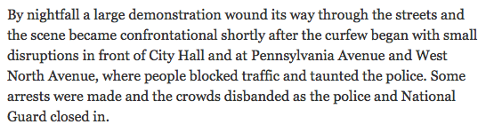
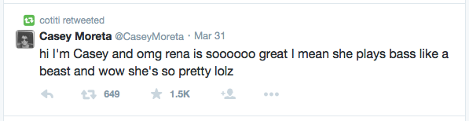

```{r, echo=FALSE, message=FALSE, warning=FALSE}
# Load required packages
library(knitr)
library(kernlab)
```
\newpage

# Introduction

In this paper, we explore various machine learning classification algorithms to determine the most effective and computationally efficient method to identify the language in which a sentence has been written (as English or other), by recognition of letter frequency.  Such a classification mechanism has many relevant applications, including web services that identify when text on a webpage must be translated to the user's default language.  Machine learning methods are advantageous for such a task due to their lack of reliance on a language dictionary.  That is, an algorithm's success does not depend on prior knowledge of the given language, including definitions, grammar structures, and correct use of accents and punctuation.

Given the considered algorithms' lack of reliance on a single "dictionary", our choice of a best method may then be extended to consider how platforms that operate in different contexts may use language differently.  For example, \textit{The New York Times} maintains an extensive language styleguide that has the potential to differentiate the formality of its articles from more colloquial interactions, such as social media posts on Twitter.

```{r, echo = FALSE}
# Read in single letter files
x <- read.csv("trainSingle.csv", stringsAsFactors = FALSE)
y <- read.csv("testSingle.csv", stringsAsFactors = FALSE)
  
# Recode language (0 = English)
x$language <- ifelse(x$language == 0, 0, 1)
y$language <- ifelse(y$language == 0, 0, 1)
```

# Methodology for Data Collection and Model Preparation

## Data Collection
We first consider observed frequency of twenty-seven characters; specifically the twenty-six letters of the Roman alphabet and a blank space.  

To train the various classfication algorithms considered, we found from the online Christian Classics Ethereal Library plain text documents of the Bible in various languages: English, French, Spanish, Latin, German, Dutch, and Italian[^bible].  Our decision to use the Bible was based on its status as a universal text, and it therefore acts as a sort of control among the languages considered.  The accessibility of plain text Bibles written in these languages informed their choosing, and because the goal of our model is to identify English sentences from non-English sentences, we were interested in a mixture of Romance languages that are Latin derivatives.

[^bible]: \textit{The Holy Bible} (various lanuage versions)

## Data Cleaning
For each of these text documents, we cleaned them in the following manner:

> * Scanned the text document into R and saved each new line of text as an individual observation in a list.
> * Converted all letters to lowercase, split each observation into a vector of individual characters, and removed any character (including any accented letter) that is not a space or letter in the Roman alphabet.
> * Created a 1200 $\times$ 28 data frame of training data, where the empirical distribution of the 27 characters (26 letters and a space) in each observation is a row.  The 28th column is a language indicator, where 0 represents that the observation was originally written in English and 1 denotes another language.  The first 600 rows are randomly chosen lines from the English language Bible, and the remaining rows consist of 100 randomly chosen lines from each of the other six Bibles.

We demonstrate our methodology with a simple example:

```{r}
example <- "Machine Learning is ~*SuPeR FuN*~ and we learned so much :) 
We hope you enjoy our project!"

myletters <- c(letters, " ")

clean <- function(string){
  vec <- tolower(string)
  vec <- unlist(strsplit(vec, split=""))
  vec <- vec[vec %in% myletters]
  return(vec)
}

cleaned <- clean(example); print(cleaned)

features <- function(vec) {
  vec <- as.numeric(sapply(myletters, FUN = function(x){round(mean(vec==x),2)}))
  vec[is.na(vec)] <- 0
  dat <- as.data.frame(t(vec))
  names(dat) <- myletters
  return(dat)
}
```

Note that the \texttt{clean} function removed characters *, ~, :, ), and ! from the original sentence.  Applying the function \texttt{features} to the vector \texttt{cleaned} returns the following relative frequency distribution:

```{r, echo = FALSE, results =  'asis'}
kable(features(cleaned)[,1:13])
kable(features(cleaned)[,14:27])
```

We see that the blank space character appears most often; specifically there are 16 spaces in the cleaned vector that contains 83 characters total.  The quotient of these values returns the observed relative frequency of 0.19 in the table above.

## Models Considered

To accomplish our stated purpose, we consider four classification algorithms:

* Logistic Regression
* Support Vector Machine with each of the following kernels:
    * Linear
    * Gaussian
    * Kullback-Leibler

To assess which of these models is the "best" at correctly classifying Bible sentences as having been written in English or another language, we evaluate the predictive ability of each model by its misclassification rate when applied to a test set of 300 randomly-selected English Bible sentences and 300 randomly-selected sentences from the other Bibles (constructed in a manner similar to that described for the training data).  We also make note of the amount of time required to train each model as a measure of its computational efficiency.

# Logistic Regression

We first consider a logistic regression model as a baseline against which to compare other machine learning algorithms due to its simplicity and accessibility as a classification device for a binary categorical reponse variable.  Because the fitted values of a logitistic regression model are easily interpretable probabilities, this model also enables us to identify those lines of test data that the model incorrectly classifies or otherwise considers somewhat ambiguous.

```{r, warning=FALSE, echo=FALSE, fig.cap="Predictions of Logistic Regression Model"}
# Model and prediction
  then <- Sys.time()
lr.0 <- glm(language ~ ., data = x, family = "binomial")
  now <- Sys.time()
pr.0 <- predict(lr.0, newdata = y, type = "response")

# Make predictions binary (0 = English, 1 = other)
pr.b <- ifelse(pr.0 < .5, 0, 1)

# Misclassification rate
mis.l <- round(mean(pr.b != y$language)*100, 2)

# Computation time
time.l <- round(as.numeric(now-then), 2)

# Plot
y$error <- 2 # Incorrect Classification
y$error[pr.b == y$language] <- 3 # Correct Classification
par(mar=c(5.1, 5.1, 5.1, 8.1), xpd=TRUE)
plot(pr.0, ylab="Predicted Probabilities",xlab = 'Observation', main="Logistic Regression",
     col = y$error, pch = 16)
legend('right', inset = c(-0.3,0),c('Correct', 'Incorrect'), col = c(3,2), pch = 16)
invisible(dev.off()) # Reset Graph Options
```

The logistic regression model is quickly trained and has misclassification rate of `r mis.l`% on the test set; we note that this provides a very good prediction of a sentence's language.

Figure 1 above shows the predictions for each observation from the logisitic regression model.  Each red point represents a misclassified observation, while each green point represents a correctly classified observation (this color convention will be used throughout the remainder of our paper).  Keep in mind when studying the plot of predicted probabilities above that our test set is structured such that the first 300 observations are English.  This figure therefore demonstrates the logistic regression model's success at correctly classifying a majority of the observations.  

The logistic regression model incorrectly classifies 25 lines from the English Bible; the complete list of original observations appears in Appendix A.  It is understandable that the model stumbled when presented with observations that consisted of only a single word, such as "die", which is also German for "the", or "violence", which has the same spelling and meaning in French.  Some of the other misclassified sentences contain phonetic spelling with Roman letters of Hebrew words and names, such as "Hazezontamar", "Japheth", and "Mizraim"; they are therefore not recognized as English.

# Support Vector Machine

## Linear Kernel

We first consider a simple Support Vector Machine with a linear kernel:
$$k(x, y) = \sum_{i=1}^n x_iy_i$$

The use of a linear kernel substantially restricts the form of the resulting decision boundary, but the reduction in complexity has the potential to provide better predictive results on a test set than a more complicated model, such as a Gaussian SVM. 

We present our code for this SVM to demonstrate our use of the \texttt{ksvm} function in the \texttt{kernlab} package:

```{r, warning=FALSE, message=FALSE, results='hide'}
# Model and prediction
then <- Sys.time()
sv.l <- ksvm(language ~ ., data=x, kernel="vanilladot", scaled=F, type="C-svc")
now <- Sys.time()
pr.svl <- predict(sv.l, newdata = y, type = "response")

# Misclassification rate
mis.svl <- round(mean(pr.svl != y$language)*100, 2)

# Computation time
time.svl <- round(as.numeric(now-then), 2)
```

```{r, echo = FALSE, fig.cap = "Predicted Outcomes from SVM Linear Kernel"}
# Create error term
y$error <- 2 # Incorrect Classification
y$error[pr.svl == y$language] <- 3 # Correct Classification

# Plot
par(mar=c(5.1, 5.1, 5.1, 8.1), xpd=TRUE)
plot(jitter(pr.svl), ylab = '', xlab = 'Observation', main="Linear Kernel Prediction",
     col = y$error, pch = 16, yaxt = 'n')
text(-120, 1, c('Other'))
text(-120, 0, c('English'))
legend('right', inset = c(-0.3,0),c('Correct', 'Incorrect'), col = c(3,2), pch = 16)
invisible(dev.off()) # Reset Graph Options
```

Figure 2 shows the predicted languages for each of the 600 test observations using the SVM with a linear kernel (jittered for visual clarity).  Its misclassification rate of `r mis.svl`% is worse than that of the logistic regression model, and we see more red points, which again represent misclassified sentences.

\newpage

## Gaussian Kernel

We next consider an SVM with a Gaussian kernel:
$$k(x, y) = \exp\left( \frac{\| x - y\|}{2\sigma^2} \right)$$

This is a very popular kernel in machine learning due to its flexibility in approximating a large variety of decision boundaries. However, it is known to be susceptible to overfitting, particularly when the training data set is small[^lec15].

```{r, echo = FALSE, warning= FALSE, message = FALSE, results='hide'}
# Model and prediction
then <- Sys.time()
sv.g <- ksvm(language ~ ., data=x, kernel="rbfdot", scaled=F, type="C-svc")
now <- Sys.time()
pr.svg <- predict(sv.g, newdata = y, type = "response")

# Misclassification rate
mis.svg <- round(mean(pr.svg != y$language)*100, 2)

# Computational time
time.svg <- round(as.numeric(now-then), 2)
```

```{r, echo = FALSE, fig.cap = "Predicted Outcomes from SVM Gaussian Kernel"}
# Create error term
y$error <- 2 # Incorrect Classification
y$error[pr.svg == y$language] <- 3 # Correct Classification

# Plot
par(mar=c(5.1, 5.1, 5.1, 8.1), xpd=TRUE)
plot(jitter(pr.svg), ylab="",xlab = 'Observation',
     main="Gaussian Kernel Prediction",
     col = y$error, pch = 16, yaxt = 'n')
text(-120, 1, c('Other'))
text(-120, 0, c('English'))
legend('right', inset = c(-0.3,0),c('Correct', 'Incorrect'), 
       col = c(3,2), pch = 16)
invisible(dev.off()) # Reset Graph Options
```

Indeed, Figure 3 above shows that the Gaussian kernel predicts a sentence's language more accurately than the linear kernel, however this SVM's misclassification rate is `r mis.svg`%, which is still worse than that of the logistic regression model.

\newpage

## Kullback-Leibler Kernel

The feature vectors in our model are in the form of relative frequencies.  We can take advantage of this structure by treating them as empirical probability distributions. We assume that languages have an underlying distribution on the frequency of letters, and that from this distribution various sentences have been randomly created. 

To determine from which underlying distribution a given sentence comes, we can use techniques from statistical theory.  We use a kernel based on the Kullback-Leibler Divergence between two distributions:

$$D(p \|  q) = \sum_{i=1}^n p_i \log\left(\frac{p_i}{q_i}\right) $$

In order to use this as a kernel in a support vector machine, we must ensure it is symmetric and positive semidefinite. Moreno \texttt{et al.} suggest the following transformation as a kernel:
$$k(x, y) = \exp(-a(D(x\|y) + D(y\|x)))$$
where $a$ is a parameter to be chosen.

Using the \texttt{kernlab} package, we implement this SVM on our language classification data set.  It runs far slower than any of the alternative algorithms, which we suspect is, to some extent, because the package is not optimized for our kernel.

Following experimentation with different values of the parameter $a$, we found that a value of **SOMETHING** minimizes the misclassification rate on the test set. With this we were able to achieve a misclassification rate of **SOMETHING**.

Because this is a user-defined fuction, we present the code below for clarity:

```{r, warning=FALSE, message=FALSE, cache=TRUE, results='hide'}
# Add very small value to all values so 0 is not an issue
xnew <- x; ynew <- y
xnew[,-1] <- xnew[,-1] + .000000000000000001
ynew[,-1] <- ynew[,-1] + .000000000000000001

KL <- function(p, q) {
  vec <- p*log(p/q)
  return(sum(vec, na.rm=T))
}

mykernel <- function(p, q) {
  exp(0.001*(KL(p, q) + KL(q, p)))   # originally -.01
}

class(mykernel) <- "kernel"

# Model and prediction
  then <- Sys.time()
sv.k <- ksvm(language ~ ., data=xnew, kernel=mykernel, type="C-svc")
  now <- Sys.time()
pr.svk <- predict(sv.k, newdata = ynew, type = "response")

# Misclassification rate
mis.svk <- round(mean(pr.svk != y$language)*100, 2) #0.242381

# Computational time
time.svk <- round(as.numeric(now-then), 2)
```

```{r, echo = FALSE, fig.cap = "Predicted Outcomes from SVM Kullback-Leibler Kernel"}
# Create error term
y$error <- 2 # Incorrect Classification
y$error[pr.svk == y$language] <- 3 # Correct Classification

# Plot
par(mar=c(5.1, 5.1, 5.1, 8.1), xpd=TRUE)
plot(jitter(pr.svk), ylab="",xlab = 'Observation', 
     main="Kullback-Leibler Kernel",
     col = y$error, pch = 16, yaxt = 'n')
text(-120, 1, c('Other'))
text(-120, 0, c('English'))
legend('right', inset = c(-0.3,0),c('Correct', 'Incorrect'), 
       col = c(3,2), pch = 16)
invisible(dev.off()) # Reset Graph Options
```

\newpage 

# Discussion of Models and Choice of a "Best"

We present in the table below a summary of each model's misclassification rate on the test set, as well as the amount of time elapsed during each model's training.

```{r, results='asis', echo=FALSE}
# Table of model, time elapsed, misclassification error?
models <- c("Logistic", "Linear SVM", "Gaussian SVM", "Kullback-Leibler SVM")
classerrors <- c(mis.l, mis.svl, mis.svg, mis.svk)
times <- c(time.l, time.svl, time.svg, time.svk)
errortable <- data.frame(Model=models, Misclassification=classerrors, Time=times)

kable(errortable)
```

The logistic regression model performs better than any of the SVM algorithms in both misclassification rate and computational efficiency.  The SVM with Kullback-Leibler kernel is by far the worst predictor of sentence language.  Although our consideration of choice of the a-parameter was thorough, perhaps further testing is required.

# Two-letter Combinations

We saw that our logistic regression model performed well when trained on the empirical distributions of single letter frequencies, and we hypothesized that we could reduce the misclassification rate even further by considering the empirical distributions of pairs of adjacent characters as they appeared in our original observations.  We suspected that greater specificity in our data set with $27^2 = 729$ columns would improve our best model's predictive accuracy because certain letter combinations are unique to specific languages.  For example, "pf" appears often in German (such as in "kopf", which means "head"), but never in English.  Similarly, "wh" appears often in English, but never in German.

We thus trained our two previously-identified top performing models, logistic regression and SVM with Gaussian kernel, on such a new data set.  

```{r, echo=FALSE, warning=FALSE, message=FALSE, results='hide'}
## Read in two-letter files
a <- read.csv("trainDouble.csv", stringsAsFactors = FALSE)
b <- read.csv("testDouble.csv", stringsAsFactors = FALSE)
  
# Recode language (0 = English)
a$language <- ifelse(a$language == 0, 0, 1)
b$language <- ifelse(b$language == 0, 0, 1)

## Logistic regression model and prediction
  then <- Sys.time()
lr.d <- glm(language ~ ., data = a, family = "binomial")
  now <- Sys.time()
time.lrd <- round(as.numeric(now-then), 2)
prlr.d <- predict(lr.d, newdata = b, type = "response")

  # Make predictions binary (0 = English, 1 = other)
  prlr.db <- ifelse(prlr.d < .5, 0, 1)
  
  # Misclassification rate
  mis.lrd <- round(mean(prlr.db != b$language)*100, 2)

## SVM Gaussian model and prediction
  then <- Sys.time()
svg.d <- ksvm(language ~ ., data=a, kernel="rbfdot", scaled=F, type="C-svc")
  now <- Sys.time()
time.svgd <- round(as.numeric(now-then), 2)
prsvg.d <- predict(svg.d, newdata = b, type = "response")

  # Misclassification rate
mis.svgd <- round(mean(prsvg.d != b$language)*100, 2)
```

```{r, echo = FALSE, fig.cap = "Predicted Outcomes from Logistic Regression and Gaussian Kernel (Double Letter Combination)"}
# Create error term for logistic
b$error <- 2 # Incorrect Classification
b$error[prlr.db == b$language] <- 3 # Correct Classification

# Create error term for Gaussian
b$error.g <- 2 # Incorrect Classification
b$error.g[prsvg.d == b$language] <- 3 # Correct Classification

# Plot
par(mfrow = c(1,2))
plot(jitter(prlr.d), ylab="",xlab = 'Observation', 
     main="Logistic Regression Prediction", 
     col = b$error, pch = 16, yaxt = 'n')
mtext(c('Other'), las =1, at = .75, side = 2, line = -3, outer = TRUE)
mtext(c('English'), las =1, at = .35, side = 2, line = -3, outer = TRUE)
plot(jitter(prsvg.d), ylab="",xlab = 'Observation', 
     main="Gaussian Kernel Prediction",
     col = b$error.g, pch = 16, yaxt = 'n')
invisible(dev.off()) # Reset Graph Options
```

When we compare the frequency of red points in plots of Figure 5, we observe that when trained on pairs of letters, the SVM with Gaussian kernel is a clear winner.  As confirmed in the summary table of results below, the SVM with Gaussian kernel takes less time to be trained than the logistic regression model, and the use of pairs of letters reduces its misclassification rate to `r mis.svgd`%. 

```{r, echo=FALSE, results='asis'}
models <- c("Logistic", "Gaussian SVM")
errors <- c(mis.lrd, mis.svgd)
times <- c(time.lrd, time.svgd)
dat <- data.frame(Model=models, Misclassification=errors, Time=times)
kable(dat)
```

We know from class[^lec15] that SVMs with a Gaussian kernel perform best when there is a great deal of information available, and we suspect that the increase of information available to the model enabled it to surpass the predictive ability of the logistic regression model.

[^lec15]: Negahban, Sahand. Data Mining and Machine Learning: Lecture 15.

\newpage 

# Application of Model: Twitter versus \textit{The New York Times}

We have demonstrated that a SVM with Gaussian kernel has great success at differentiating sentences written in the English language from sentences written in other languages when trained with a good amount of data (in the form of relative frequencies for each of the possible 729 letter pairs per observation).  We are also interested in the extension of this finding to different uses of the English language.  Formal writing differs dramatically in style, punctuation, sentence structure, and vocabulary from more casual interactions, such as those that take place through social media platforms and make frequent use of abbreviations and slang.  All editors and writers for \textit{The New York Times} are expected to uphold the regulations set forth in \textit{The New York Times Manual of Style and Usage}.

We are curious as to whether or not a SVM with Gaussian kernel is still effective when challenged to distinguish between formal and colloquial uses of the English language.  Specifically, we try to correctly classify observations from social media messages on Twitter and sentences from \textit{New York Times} articles.  Figure 6[^nyt] is an example of a sentence that appears in a \texttt{New York Times} article and Figure 7[^tweet] is a public tweet:

[^nyt]: Blinder \textit{et al.}

[^tweet]: cotiti





## Collection of \textit{New York Times} and Twitter Data

We trained a logistic regression model and our "best" model, the SVM with Gaussian kernel, using relative frequencies of pairs of letters that appear in sentences from each of \textit{The New York Times} and public postings from Twitter.  Using the Twitter API, we extracted 1000 of the most recent tweets from the site (as of 8:00 pm on Tuesday, April 28, 2015).  Similarly, we randomly chose 1000 sentences extracted from the top fifteen "Most Viewed" articles on www.nytimes.com (as of Friday, May 1st at 3:30 pm) using the \textit{Times} API.

Each tweet from Twitter and each sentence from \textit{The New York Times} was cleaned using the same methodology described in Section 2.2, and the empirical distribution of frequencies of pairs of letters were created.  Our training data set consists of 600 tweets and 600 \textit{New York Times} sentences.

```{r, echo = FALSE, warning = FALSE, message = FALSE,results='hide'}
# Twitter is language == 1
app <- read.csv("tweets_nytimes.csv", stringsAsFactors = FALSE)

# Create test and training sets
set.seed(1)
these <- sample(1001:2000, 700, replace = FALSE)
train <- app[c(1:700, these),]
test <- app[-as.numeric(rownames(train)),]

## Logistic regression model and prediction
  then <- Sys.time()
lr.app <- glm(language ~ ., data = train, family = "binomial")
  now <- Sys.time()
time.app <- round(as.numeric(now-then), 2)
prlr.app <- predict(lr.app, newdata = test, type = "response")

  # Make predictions binary (0 = English, 1 = other)
  prlr.appb <- ifelse(prlr.app < .5, 0, 1)

  # Misclassification rate
  #round(mean(prlr.appb != test$language)*100, 2)
  mis.app <- round(mean(prlr.appb != test$language)*100, 2)

## SVM with Gaussian kernel
  then <- Sys.time()
svg.app <- ksvm(language ~ ., data=train, kernel="rbfdot", scaled=F, type="C-svc")
  now <- Sys.time()
time.svg.app <- round(as.numeric(now-then), 2)
pr.svgapp <- predict(svg.app, newdata = test, type = "response")

  # Identify chosen sigma
  #svg.app@kernelf@kpar$sigma
  
  # Misclassification rate
  #1-mean(pr.svgapp == test$language)
  mis.svg.app <- round(mean(pr.svgapp != test$language)*100, 2)
```

```{r, echo = FALSE, warning = FALSE, message = FALSE, fig.cap = "Predicted Outcomes from Logistic Regression and Gaussian Kernel (NY Times Application)"}
# Create error term for logistic
test$error <- 2 # Incorrect Classification
test$error[prlr.appb == test$language] <- 3 # Correct Classification

test$error.g <- 2 # Incorrect Classification for Gaussian
test$error.g[pr.svgapp == test$language] <- 3 # Correct Classification

# Plot
par(mfrow = c(1,2))
plot(jitter(prlr.appb), ylab="",xlab = 'Observation', 
     main="Logistic Regression Prediction", 
     col = test$error, pch = 16, yaxt = 'n')
mtext(c('Twitter'), las =1, at = .75, side = 2, line = -3, outer = TRUE)
mtext(c('NY Times'), las =1, at = .35, side = 2, line = -4, outer = TRUE)
plot(jitter(pr.svgapp), ylab="",xlab = 'Observation', 
     main="Gaussian Kernel Prediction",
     col = test$error.g, pch = 16, yaxt = 'n')
invisible(dev.off()) # Reset Graph Options
```

Figure 8 compares the predicted sentence sources from the two models, logistic regression and SVM with Gaussian kernel.  Note that the first 300 observations of the test set are tweets, while observations 301-600 are sentences from the \textit{New York Times}.  The fewer number of red points suggests that the SVM with Gaussian kernel misclassifies the sources of sentences less frequently than does the logistic regression model.  Furthermore, it takes less time to train than the logistic regression model when presented with an abundance of data.

```{r, results='asis', echo=FALSE}
models <- c("Logistic", "Gaussian SVM")
errors <- c(mis.app, mis.svg.app)
times <- c(time.app, time.svg.app)
dat <- data.frame(Model=models, Misclassification=errors, Time=times)
kable(dat)
```

\newpage

## Model Limitations Specific to Classification of \textit{New York Times} versus Twitter

We recognize that our data cleaning function presents obvious limitations that may specfically influence our model's ability to classify sentences as being either from the \textit{New York Times} or Twitter.  As previously discussed in Section 2.2, the function removes all capitalization of letters, as well as unique symbols.  Tweets make frequent use of the hashtag (#) and at (@) symbols, and this syntax is immediately.  Inclusion of such characters would likely increase the predictive ability of the SVM with Gaussian kernel.  Similarly, we know that punctuation differs between sentences appearing in \textit{The New York Times} and tweets.  While tweets sometimes provide emphasis with multiple exclamation points, this a pattern that would occur rarely (if ever) in a formal newspaper.

Furthermore, because our function split sentences from \textit{New York Times} articles along periods, there were observations that consisted only of "mr" or "ms" that occurred when a person was referred to in an article as, for example, "Mr. [last name]".

\newpage

# Conclusion

## Findings

Given that we only gave it 1200 training lines, prediction is very good without any user input

Haven’t needed to tell it anytime about the languages considered


## General Model Limitations

We recognize that our use of the Bible for classification algorithm training and testing limit the scope of our project, and we therefore do not claim to find the "best" model for language detection and classification of \textit{any} sentence.  However, we believe that our careful consideration of each of the techniques provide an outline by which extended study could be based.

Furthermore, our data collection and cleaning methodology from this source resulted in sentences that were essentially nonsense; either they consisted of too little information (a single word) or words that were not specifically English. 

## Possible Extensions of Our Work

Classification of languages as more than just English/non-English

\newpage

# References

Blinder, A., & Perez-Pena, R. (2015, May 1). 6 Baltimore Police Officers Charged in Freddie Gray Death. \texttt{The New York Times}. Retrieved May 4, 2015, from http://www.nytimes.com/2015/05/02/us/freddie-gray-autopsy-report-given-to-baltimore-prosecutors.html?_r=0

cotiti. [CotiCN21]. (2015, March 31). RT [CaseyMoreta] hi I’m Casey and omg rena is soooooo great I mean she plays bass like a beast and wow she’s so pretty lolz [Tweet]. Retrieved from https://twitter.com/CaseyMoreta/status/582764574388068354 

The Holy Bible: Dutch Statenvertaling. (n.d.). Christian Classics Ethereal Library. Retrieved April 24, 2015, from http://www.ccel.org/ccel/bible/nls.txt

The Holy Bible: French Louis Segond Translation. (n.d.). Christian Classics Ethereal Library. Retrieved April 24, 2015, from http://www.ccel.org/ccel/bible/frls.txt 

The Holy Bible: German Luther Translation. (n.d.). Christian Classics Ethereal Library. Retrieved April 24, 2015, from http://www.ccel.org/ccel/bible/delut.txt

The Holy Bible: Italian Translation. (n.d.). Christian Classics Ethereal Library. Retrieved April 24, 2015, from http://www.ccel.org/ccel/bible/it.txt
 
The Holy Bible: Latin Vulgate Translation. (n.d.). Christian Classics Ethereal Library. Retrieved April 24, 2015, from http://www.ccel.org/ccel/bible/vul.txt 
 
The Holy Bible: Spanish Reina Valera. (n.d.). Christian Classics Ethereal Library. Retrieved April 24, 2015, from http://www.ccel.org/ccel/bible/esrv.txt
  
The Holy Bible: Webster's Bible. (n.d.). Christian Classics Ethereal Library. Retrieved April 24, 2015, from http://www.ccel.org/ccel/bible/webster.txt

Moreno, P.J., Purdy. H.P., & Vasconcelos, N. (n.d.). A Kullback-Leibler Divergence Based Kernel for SVM Classification in Multimedia Applications. Retrieved April 29, 2015, from http://machinelearning.wustl.edu/mlpapers/paper_files/NIPS2003_SP02.pdf

Negahban, S. (2015, March 4). Data Mining and Machine Learning: Lecture 15 [.pdf Notes]. Retrieved April 29, 2015, from https://classesv2.yale.edu/access/content/group/stat365_s15/Lectures/lec15.pdf


\newpage 

# Appendices

## Appendix A: Logistic Regression Model's Misclassified English Bible sentences
```{r, echo=FALSE, results='asis'}
# Finding which lines of the bible were misclassified. Note that this code only 
# works for english lines that were misclassified. More work needed if we want
# other languages.
misclass <- which(pr.b != y$language) # Find which are misclassified
misclass <- misclass[misclass <= 300] # Only want the english misclassifications

dictionary <- read.csv("testIndex.csv") 
misclass <- dictionary$original[misclass] # Find which line of english bible had this index
raw <- read.csv("englishRaw.csv", stringsAsFactors=F)
misclass <- raw$x[misclass] # Actual bible lines
dat <- data.frame("Misclassified Lines"=misclass)
kable(dat, output = TRUE)
```
